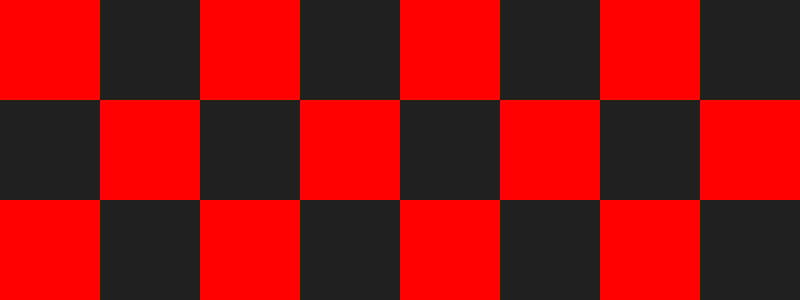
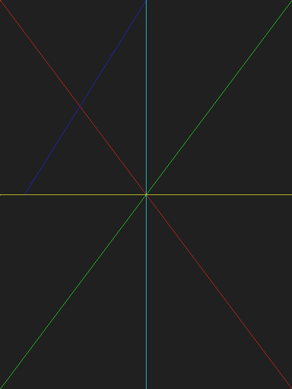

# Ziggy-Graphics

Simple graphics stuff in Zig.
Following roughly along with Tsoding's [Olive.c](https://github.com/tsoding/olive.c)

I am using the latest Zig version availble and 
```console
$ zig build run
```
should produce images from `main.zig`, the graphics stuff is separated into `mod.zig`.

## Gallery






